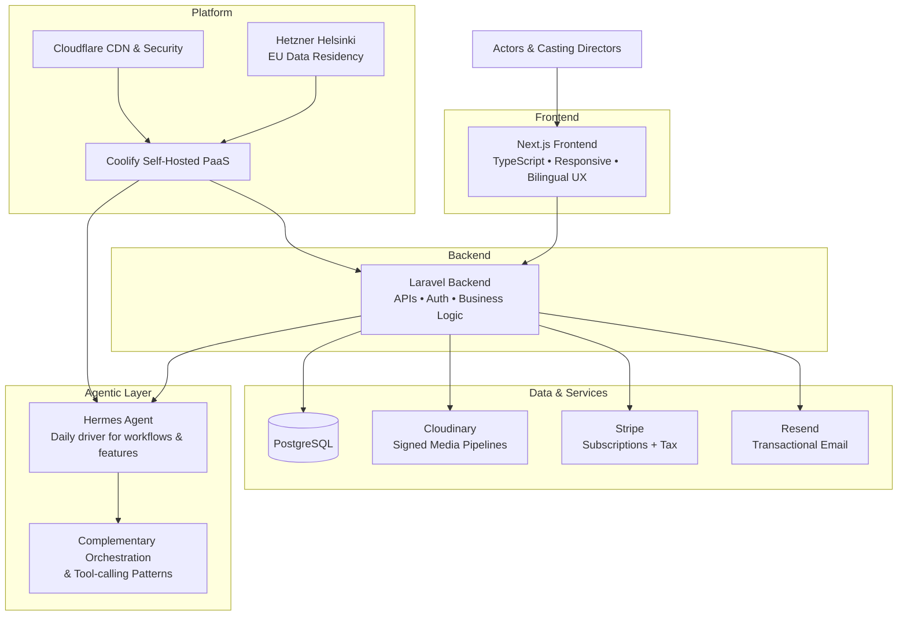

# Horizon Casting Portfolio

**Public Architecture & Technical Documentation**

**Horizon Casting by Ombre & Pixel**  
Bilingual SaaS platform for artists, actors (including child actors and voice actors), and creatives to build rich, discoverable profiles for casting directors, productions, and photographers.

This repository provides a transparent view of the architecture, compliance posture, technical decisions, and agentic development systems behind the private production codebase. It is prepared to demonstrate end-to-end full-stack engineering, production deployment, privacy-first design, and high-agency shipping in the context of an application for the **Full Stack Engineer** role at **Nous Research**.

---

## Alignment with Nous Research Full Stack Engineer Role

The role requires owning software end-to-end across stacks — from managed inference services and platform infrastructure to agent UX and developer-facing APIs — while shipping user-facing products (Nous Portal, Hermes Agent) and solving hard technical problems with rigorous testing.

This body of work maps directly:

- **End-to-end production ownership**: Complete architecture and delivery of a live SaaS platform including frontend, backend services, media pipelines, payments, deployment, security, and compliance under real regulatory constraints.
- **Agentic systems & infrastructure**: Heavy daily user of Hermes for agentic workflows, development acceleration, and product intelligence features. Built complementary self-hosted orchestration patterns and tool-calling layers that integrate with Hermes and similar systems.
- **Privacy & security posture**: Production implementation of strict controls for sensitive personal media and identity data (Quebec Law 25 PIA + Transfer Impact Assessment, PIPEDA, GDPR) — directly relevant to building trustworthy AI products.
- **High-agency execution & velocity**: Solo shipping of complex MVP with intense output through structured AI-augmented workflows while maintaining quality and compliance.
- **Platform & deployment experience**: Self-hosted PaaS (Coolify), EU VPS with data residency, CDN, Dockerized services, and security hardening — practical experience with the infrastructure layers central to Nous products.

I bring not only code, but demonstrated ability to own broad-scope systems, ship interfaces users love, embed testing, and operate with the curiosity and self-motivation the role demands.

---

## Project Overview

Horizon Casting enables creative professionals to create compelling, searchable profiles that connect them with opportunities in film, television, photography, and related fields. Core capabilities include rich media support (photos, videos, voice), semantic discovery features for casting professionals, tiered subscriptions, and a privacy-respecting architecture suitable for sensitive personal data including that of child actors.

**Status**: MVP live in production with initial users; active iteration toward hundreds of profiles. Bilingual (English/French) UX delivered from day one.

---

## High-Level Architecture

**Key Flows**:
- Actors create and manage rich profiles with secure media uploads and transformations.
- Casting directors discover talent via semantic search and structured profiles.
- All sensitive data paths enforce encryption, consent, minimization, and residency controls.
- Agentic layer accelerates both development velocity and product intelligence features while remaining auditable.

---

## Compliance & Privacy Architecture

One of the most critical and transferable aspects of this system.

- Full Privacy Impact Assessment (PIA) and Transfer Impact Assessment executed for Quebec Law 25 on sensitive visual and identity data (including minors).
- Data minimization by design: only essential information collected; media strategy prioritizes verifiable external links (YouTube, Vimeo) with optional premium Cloudinary rich media.
- Explicit consent flows, granular access controls, and clear implementation of data subject rights.
- EU hosting (Hetzner Helsinki) selected for strong data residency alignment.
- Encryption in transit and at rest; signed URLs and secure delivery for all media.
- Audit logging and role-based controls suitable for production use with sensitive personal data.
- Bilingual privacy policy and consent language.

This experience provides practical, production-level insight into the regulatory and architectural requirements for any system processing personal media or identity data — a direct foundation for responsible AI tooling and platforms.

---

## Agentic Layer & Development Workflows

I am a heavy daily user of **Hermes** for agentic workflows, development acceleration, and product features. Hermes powers structured loops for complex engineering tasks, persistent context across sessions, and intelligent routing across models.

I have also built complementary self-hosted orchestration patterns and tool-calling layers (lightweight elements drawing from patterns similar to OpenClaw) that integrate seamlessly with Hermes and other agent frameworks. These patterns enable reliable multi-step workflows, verification steps, and high-leverage solo execution while staying aligned with the self-improving, persistent agent philosophy that Hermes exemplifies.

This combination gives me intimate, practical experience with the exact capabilities Nous has productized: persistent memory, skill refinement through use, multi-provider intelligence, and agents that function as dependable infrastructure rather than one-off interactions.

---

## Technical Decisions & Tradeoffs

- **Stack choice (Next.js + Laravel)**: Next.js delivers modern type-safe frontend development, excellent UX/SEO capabilities, and strong component patterns. Laravel was selected for rapid, secure backend iteration with a mature ecosystem for auth, queues, APIs, and business logic — enabling high solo velocity on a regulated product. Core patterns (API design, media handling, compliance boundaries, deployment) transfer directly to Python, Node.js, or Rust stacks.
- **Media handling strategy**: Hybrid approach that prioritizes external links for core profiles (cost control, simplicity, verifiability) while offering premium Cloudinary pipelines for rich media. Signed uploads and transformations ensure security and performance.
- **Deployment & residency**: Coolify on Hetzner Helsinki provides self-hosted PaaS control, EU data residency, and avoidance of vendor lock-in. Cloudflare layers global CDN, caching, and additional security.
- **Compliance-first design**: Regulatory requirements shaped data models, hosting geography, consent UX, logging, and access controls from the first iteration rather than as retrofits.
- **Agentic acceleration**: Structured use of Hermes plus complementary orchestration delivers outsized output without sacrificing architectural integrity or auditability.

---

## Production Outcomes

- Complete MVP shipped and live (horizoncasting.studio) with real initial users and clear growth path.
- Full compliance implementation delivered (PIA artifacts, technical controls, policies) from the ground up.
- Production-grade deployment with security hardening, automated backups, observability, and CDN.
- Bilingual experience and semantic discovery features operational.
- Intense development velocity achieved through Hermes-powered compound workflows while shipping under regulatory and media-complexity constraints.

---

## Repository Purpose

This public repository serves as a focused portfolio artifact. It emphasizes architecture, rationale, tradeoffs, and explicit relevance to the target role. The core production codebase remains private.

I am fully prepared to provide secure access, code walkthroughs, architecture deep-dives, live demonstrations of agentic workflows with Hermes, or compliance flow reviews during any interview or diligence process.

---

## Contact

**GitHub**: https://github.com/roninhaf  
**Primary Private Repo**: solid-happiness (Horizon Casting production)  
**Live Product**: horizoncasting.studio

Thank you for reviewing this portfolio. I am excited by the opportunity to contribute to Nous Portal, Hermes Agent, inference services, and the mission of putting powerful, open intelligence in the hands of many.

— Hafid Feghouli  
Montréal, Québec  
June 2026
